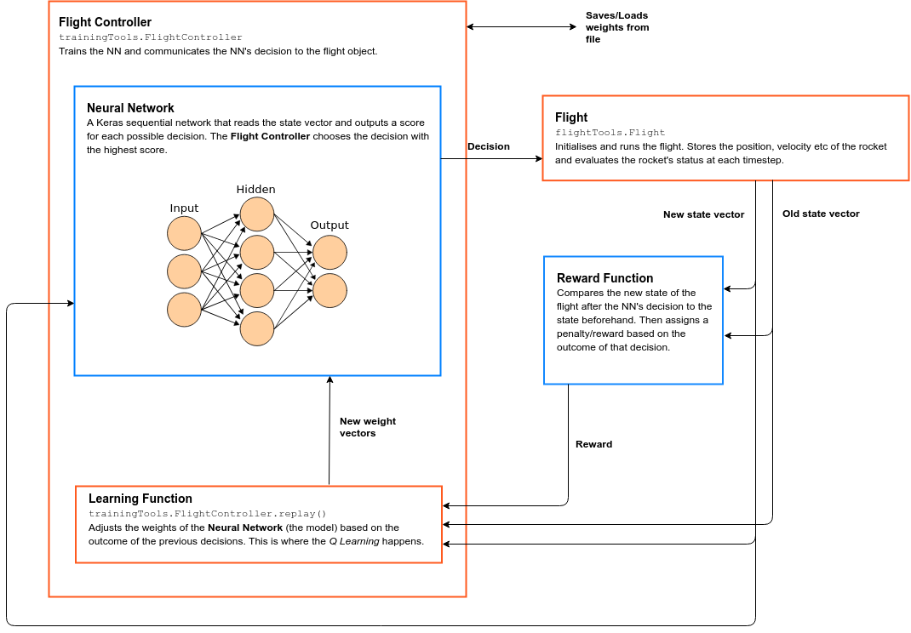

In this project we'll attempt to train a neural network to land a rocket [à la SpaceX](https://www.youtube.com/watch?v=u0-pfzKbh2k) in a simple physics simulation. We'll add complexity to the problem as we progress. Please read through the below for an overview of the ideas. 

#### Download the materials with [this link](https://github.com/conor-or/ai-rocket/archive/master.zip)

#### You will need to install [TensorFlow](https://www.tensorflow.org/install/) and [Keras](https://keras.io/#installation) (in that order) before we start.

# 1. Some Rocket Science

A rocket accelerates by expelling some material (often by a chemical reaction) in the direction opposite to the one it wants to travel in. The conservation of momentum then propels the rocket in the desired direction.

Our simulation will involve a small rocket attempting to land on a platform in the ocean. If the rocket hits the ocean or the sides of the simulation it crashes. If it hits the platform at a suitably small velocity it lands successfully. The rocket starts in a random position high above the platform. At each timestep, the AI can decide whether to fire the thrusters or not (and in which direction) with the goal of achieving a safe landing is made. 

The simulation can operate in one of three modes:

### Mode 0

The rocket __only moves vertically__. It begins at some random height directly above the platform with some random vertical velocity. It can fire a single thruster on the bottom of the rocket to decelerate. It must reach the platform with a vertical velocity below a certain threshold to achieve a safe landing

_This mode will serve as our introduction and a successful AI can be trained on this in 20-30 mins._

### Mode 1

We now add __horizontal motion__ to the above. The rocket now begins in a completely random (x, y) point somewhere high up above the platform and has a random velocity (both horizontal and vertical). In addition to the main thruster on the bottom the AI now also has smaller thrusters on both sides of the rocket that move it left and right. The rocket must land on the platform below a certain total velocity threshold to achieve a safe landing.

_This is where I envision us spending most of the project and training on this mode can take a few hours_

### Mode 2

In this mode the L/R thrusters don't move the rocket left and right but rotate the rocket about its centre of mass. This is much more like how the thrusters on a real rocket would be arranged. The correct movement can then only be achieved by first pointing the rocket in the right direction and then firing the main thruster. A successful landing requires both a low total velocity as above but also that the rocket be upright and have a low angular velocity.

_This mode is more like an extension that we can attempt if we complete the above_

# 2. Neural Networks

Now a digression. A neural network (NN) is essentially just a very complicated function which takes many inputs and produces (usually) one or a small number of outputs. It's used to make predictions based on lots of input data where the functional form of the predictor itself is not clear. For example, classifying the objects in an image (input: 512x512 grid of pixel values, output: text label describing the object).

The NN is made up of nodes or _neurons_ organised into _layers_. Each neuron is really a very simple function (for example: _y_ = _w_ * _X_). It receives some _X_ from the input data and computes _y_ given some constant(s) _w_ called the _weights_. If our input has 4 numbers then all the nodes in the first _layer_ take a vector _X_ of 4 numbers. These nodes might connect to one single node providing an output _y_ or they might again be the input for a second layer. A NN with multiple layers between input and output is called a _deep neural network_ and the layers between input and output are called _hidden layers_.

The __weights__, _w_ tell the network exactly what output to give based on the input and the weights encode all of the information about the data we have. We learn the weights by _training_ the network. At first the weights are random. We then use the network to predict a _y_ value based on some data where we _already know the true outcome_. The network then adjusts its own weights depending on how close it was to the true value. This data, where we already know the true outcome to compare to the prediction, is called the _training data_ or _training set_.

# 3. Q Learning

__Please also see [this article](https://www.intel.ai/demystifying-deep-reinforcement-learning/#gs.ad9lx4) for a much more in-depth discussion__

The training process becomes more difficult when the outputs of the network do not produce an immediate feedback that it can train on. This is exactly the case in our situation. At a given moment it might be a good idea for the AI to (for example) fire the main engine and slow down. But this action doesn't immediately achieve our final goal, safely landing. All it does it slow the rocket down temporarily. Slowing the rocket down temporarily is a _tactic_, the overall goal is the _strategy_. It's often trivial to train tactics but strategy is a much more difficult problem.

This is where _Q-Learning_ comes in. First we add a new component to the problem, the __reward function__. This is simply some function which compares the state of the rocket before the AI made its decision to the state afterwards. If the state has improved, the AI receievs a reward and a penalty if its new situation is worse.

Each decision the AI makes then leads to a new situation and a new set of decisions. At each step we want the AI to take the decision which maximises the future possible rewards, coming from all its future possible decisions. In this way the AI can strategise.

Each decision has a 'quality' or a Q-score, a number which represents the possible future rewards from making that decision.  Q can be thought of as a function of the current state of the rocket which returns a score for each possible decision. We want the AI to take the decision with the highest Q. By recording the state of the rocket at each timestep, the decisions the AI takes, and the reward it receives afterwards, the AI can effectively __learn the Q function__. Specifically, our neural network will be a model for Q. The AI will input the current state of the rocket into the network and receive the predicted future scores for each decision. We then take the decision with the highest score. In the next timestep we see what score we really received. Over time the AI's predictions improve and eventually the neural network comes to approximate the true form of Q.

# 4. Training

The code works according to the process in the diagram below. The diagram essentially illustrates what happens in each timestep.

